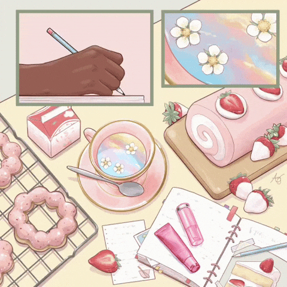

<h1 align="center">Hi! I'm Avigail Musai 💖👩🏻‍💻</h1>

  

  A Software Engineering student who loves clean code, OOP, cute aesthetics,  
  and building fun projects that (usually 😅) work on the first try.  

---

## 🌸 About Me
- 🎀 Third-year Software Engineering student  
- ☕ Addicted to Java & object-oriented design  
- 🧠 Into algorithms, backend logic, and nerdy problem-solving  
- ✨ I like my code neat, organized, and a little bit pink  
- 🎧 Probably debugging with lo-fi vibes  

---

## 🛠️ Tech Stack

  

---

## 🎀 Featured Project
### 🧩 OOP Course Project (Java)

A university project focusing on object-oriented design, including:
- Classes, interfaces & inheritance  
- Clean architecture  
- Modular, readable structure  

👉 **Repository:** https://github.com/avigail4268/OPP-project

  

---

## 💖 GitHub Stats

  
   
  

---

## 🌸 Extra Cute GIF

  

---

## 💌 Contact
- 💼 LinkedIn: [Avigail Musai](https://www.linkedin.com/in/avigail-musai-02a078365/?locale=en)  
- 📧 Email: avigail4268@gmail.com  
- 📱 Phone: 050-9473999  

Thanks for visiting my profile! 💗✨

